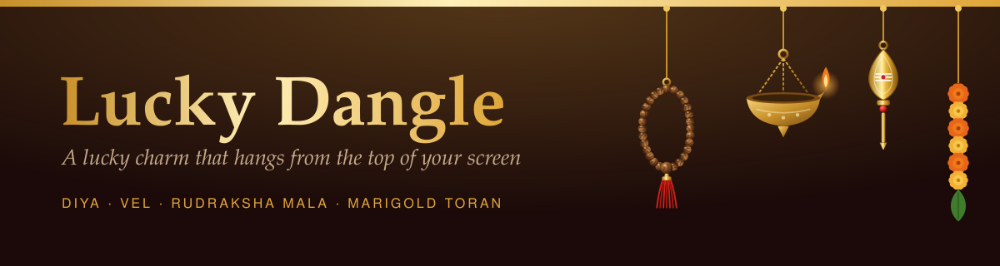

# 🪔 Lucky Dangle

**A lucky charm that hangs from the top of your screen while you work.**

A brass diya sways in the corner. Double-click it and the flame flares. Chant a round on a rudraksha mala. Ring a temple bell before a big meeting. Everything else on your screen stays clickable, because the charm never gets in the way.

Built with Electron and plain JavaScript. Runs on macOS, Windows and Linux.

> Work in progress. The name and some of the art are placeholders. See [Credit and status](#credit-and-status).

---

## Try it

```bash
git clone https://github.com/smartjaganrao/lucky-dangle-hybrid.git
cd lucky-dangle-hybrid
npm install
npm start
```

The app lives in your **menu bar** (macOS) or **system tray** (Windows, Linux). It has no Dock icon. Click the tray icon to open the gallery, switch charms or quit.

Shortcuts: `./start.sh` on macOS and Linux, `run-dangle.bat` on Windows.

---

## What it does

- **Hangs from the screen edge.** No window, border or shadow. Only the charm is solid; clicks everywhere else go straight through to your apps.
- **Moves like a real charm.** Rope physics with a gentle breeze. Flick it, drag it, watch it settle.
- **Slides along the edge.** Drag the bar at the top to put the anchor wherever you like.
- **Up to 8 at once.** Each charm gets its own rope and anchor.
- **Every charm has a ritual.** Double-click, press the shortcut, or use the tray menu.
- **Gallery.** Each charm comes with its origin and a short story.

### Shortcuts

| Action | macOS | Windows / Linux |
| --- | --- | --- |
| Show or hide the charms | `⌘` `Shift` `D` | `Ctrl` `Shift` `D` |
| Perform the ritual | `⌘` `Shift` `S` | `Ctrl` `Shift` `S` |

Both include Shift on purpose, so they never take over Save or Bookmark.

---

## The charms

### Drawn from scratch for this project

| | Charm | Ritual |
| --- | --- | --- |
| 🪔 | **Diya** (Thooku vilakku), a brass hanging lamp | The flame flares up |
| 🔱 | **Vel**, Murugan's leaf-bladed spear | The spear glows |
| 📿 | **Rudraksha mala**, 27 seeds, a guru bead and a tassel | Chant a round: the seeds light up one by one, then the guru bead |
| 🌼 | **Marigold toran** (Genda phool) | Flick it to shake out the old week |

### Traditional charms from around the world

Nazar boncuğu (Turkey), Hamsa (Middle East), Nimbu-mirchi (India), Ghanta (India), Drishti bommai (South India), Chinese knot, Daruma (Japan), Maneki-neko (Japan), Horseshoe, Scarab (Egypt) and Himmeli (Finland).

You can also hang **any emoji** or **your own image**.

---

## Add a charm

1. Draw it as SVG in `src/charms.js` and add an entry to `CHARMS`, with a `ritual.kind`.
2. Handle that kind in `performRitual()` and `updateRituals()` in `src/overlay.js`.

The rudraksha mala is a good example to copy. Its commit touches only those two files.

| File | Purpose |
| --- | --- |
| `src/main.js` | Overlay window, tray, shortcuts, settings |
| `src/overlay.*` | The charms and their ritual animations |
| `src/physics.js` | Verlet rope and pendulum |
| `src/charms.js` | Charm definitions and vector art |
| `src/gallery.*` | Gallery and settings window |
| `src/preload.js` | Context bridge and per-platform shortcut labels |

---

## Package it

```bash
npm run dist:mac
npm run dist:win
npm run dist:linux
```

Builds land in `dist/`.

---

## Credit and status

Started as a fork of [07bharathi/Luckydangle1.0](https://github.com/07bharathi/Luckydangle1.0), itself a clone of the commercial [Lucky Dangle](https://luckydangle.app/) app. That repository says MIT in `package.json` but has no `LICENSE` file, so the licence of the inherited code and art is unclear.

Before any public or paid release I will:

- [ ] pick a new name and app icon
- [ ] replace the inherited charm art and descriptions with original work
- [ ] remove charms that use third-party characters
- [ ] test and package on Mac (arm64), then Windows

Done so far: original Indian charms, and several charms on screen at once.

Made by [Jagan Rao](https://github.com/smartjaganrao).
